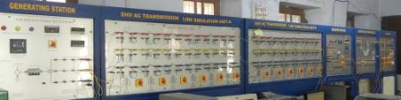
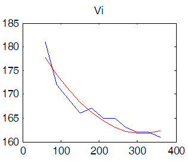
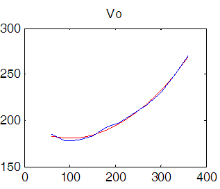
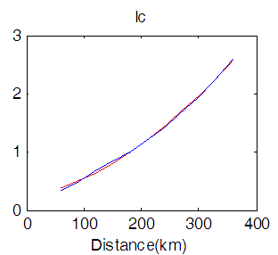
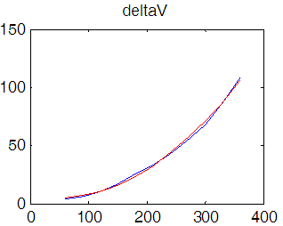

## Procedure

1. Select initial length of line (say 30 kms).
2. Start the motor-generator set.
3. Note down the sending end voltage Vi, sending end current Ii and receiving end voltage Vo.
4. Disconnect the supply of motor-generator set.
5. Increase the length of line.
6. Repeat the steps 2-5.

   

  
## Connection Diagram of Experiment 

**Fig 9.1: Experimental Setup for studying the Ferranti Effect**

## Observation Table

| S. No. | Length of the line (km) | Sending end voltage Vi (volts) | Receiving end voltage Vo (volts) | Sending end current Ii (amp) | Receiving end current Io (amp) |
|:---:|:---:|:---:|:---:|:---:|:---:|
| 1 | 30 | | | | |
| 2 | 60 | | | | |
| 3 | 90 | | | | |
| 4 | 120 | | | | |
| 5 | 150 | | | | |
| 6 | 180 | | | | |
| 7 | 210 | | | | |
| 8 | 240 | | | | |
| 9 | 270 | | | | |
| 10 | 300 | | | | |
| 11 | 330 | | | | |
| 12 | 360 | | | | |

  
## Effect of Transmission Line Length  Graphs

### Sending End Voltage

### Receiving End Voltage

### Charging Current

### Change in Voltage (ΔV)

