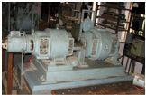
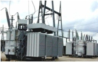
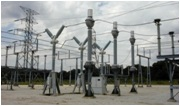
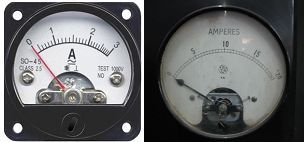
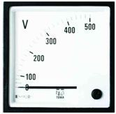
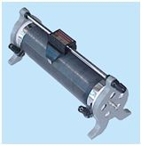

# Experiment 9: Theory and Procedure

## Theory: Ferranti Effect

A long transmission line/cables draws a substantial quantity of charging current. If such a line/cable is open circuited or very lightly loaded at the receiving end, the voltage at receiving end may become greater than voltage at sending end due to capacitive reactance. This is known as Ferranti Effect. Both capacitance and inductance is responsible to produce this effect. The capacitance (which is responsible for charging current) is negligible in short line but **significant** in medium line and **appreciable** in long line. Hence, this phenomenon occurs in medium and long lines. The figure shown below is representing a transmission line by an equivalent pi (π)-model. The voltage rise is proportional to the square of the line length.

.jpg)

The Line capacitance is assumed to be concentrated at the receiving end.

In the phasor diagram shown above:
- OM = receiving end voltage Vr
- OC = Charging current drawn by capacitance = Ic
- MN = Resistive drop
- NP = Inductive reactance drop
- Therefore, OP = Sending end voltage at no load and is less than receiving end voltage (Vr)

Since resistance is small compared to reactance, resistance can be neglected in calculating Ferranti effect. From π-model, Vs = Vr - Impedance drop.

Under open circuit condition Ir = 0 and hence, Vs = Vr - IcR - jwL × Ic i.e., receiving end voltage is greater than sending end voltage and this effect is called Ferranti Effect. It is valid for open circuit condition of long line.

When load current is increased of R-L loads the resultant current is not remains leading, because of the inductive drop. Hence, receiving end voltage (Vr) is lesser than sending end voltage (Vs) under full load conditions.

# Equipments Required in Experiment - 9

| Equipment | Image |
| :--- | :--- |
| **Fig.1: Motor Generator** |  |
| **Fig.2: Transformer** |  |
| **Fig.3: Transmission line** |  |
| **Fig.4: Ammeter** |  |
| **Fig.5: Voltmeter** |  |
| **Fig.6: Rheostat** |  |
